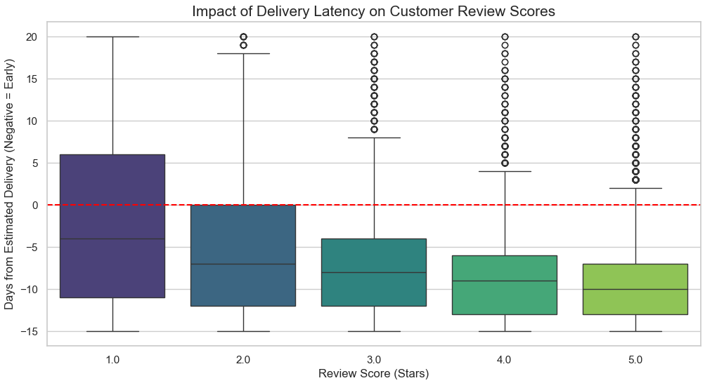
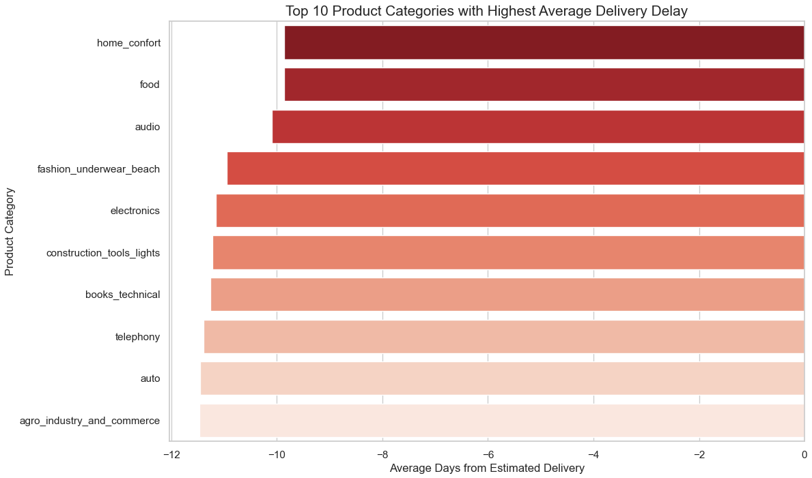

# 📦 Olist E-Commerce — Logistics & Satisfaction Analysis

> **End-to-end data analysis project exploring how logistics performance directly impacts customer satisfaction — built on 100,000+ real orders from Brazil's largest e-commerce platform.**

[](https://python.org)
[](https://www.microsoft.com/sql-server)
[](https://powerbi.microsoft.com)
[]()
[]()

---

## 🧠 The Business Problem

In e-commerce, delivery speed is not just a logistics KPI — it is a loyalty driver. Late deliveries don't just frustrate customers; they directly destroy review scores, damage brand reputation, and increase churn.

Olist, Brazil's largest e-commerce marketplace, needed to answer a critical question:

> *Which logistics factors are causing low customer ratings — and which regions and product categories are consistently breaking SLA promises?*

Without a unified view across 8+ fragmented data tables, the business had no way to connect supply chain performance to customer sentiment.

**This project builds that connection.**

---

## ✅ The Solution

An end-to-end analytics pipeline that joins fragmented operational data, computes key logistics KPIs, performs statistical analysis in Python, and surfaces actionable insights through an executive Power BI dashboard.

> *From 8 raw CSV files to a decision-ready dashboard that reveals exactly where the logistics chain is failing customers — and by how much.*

---

## 📐 Architecture Overview

```
┌─────────────────────┐    ┌──────────────────┐    ┌─────────────────────┐
│   8 Raw CSV Files   │───▶│  SQL Server ETL  │───▶│   Python Analysis   │
│   (Olist Dataset)   │    │  T-SQL Queries   │    │  Pandas · Seaborn   │
└─────────────────────┘    └──────────────────┘    └──────────┬──────────┘
                                                               │
                                         ┌─────────────────────▼──────────┐
                                         │       Power BI Dashboard        │
                                         │  KPIs · Trends · Geo · Rankings │
                                         └────────────────────────────────┘
```

---

## 🔄 Methodology — STAR Framework

### Situation
The Olist dataset contained 100,000+ orders fragmented across 8 tables: orders, customers, products, order items, reviews, sellers, payments, and product categories. No unified view existed connecting logistics performance to customer sentiment.

### Task
Build an analytical pipeline that:
- Joins all relevant tables via optimized SQL queries
- Computes delivery delay metrics (actual vs. estimated delivery dates)
- Identifies the statistical relationship between delay and review score
- Surfaces geographic and category-level insights for operational decisions

### Action

**1 — Data Engineering (SQL Server / T-SQL)**
Developed 3 optimized analytical queries:
- **KPIs & Revenue:** joins orders, items, products, and categories to compute revenue, shipping cost, and shipping ratio per order
- **Delivery Performance:** calculates `actual_delivery_days` and `delay_days` (days vs. estimated date) for all delivered orders
- **Geographic Analysis:** aggregates revenue, order volume, average ticket, and shipping cost by customer state

**2 — Statistical Analysis (Python)**
- **Boxplot analysis:** visualized the distribution of `delay_days` against `review_score` — revealing a clear statistical relationship across 96,353 delivered orders
- **Category analysis:** ranked product categories by average delivery delay to identify operational bottlenecks

**3 — Business Intelligence (Power BI)**
Built an executive dashboard with 4 KPIs and 5 visualizations telling a complete logistics story.

### Results

**Key Insight #1:** Orders that arrive even 1 day past the estimated delivery date show a significant drop in average review score — confirming that SLA accuracy, not just speed, drives customer satisfaction.

**Key Insight #2:** The `music` category has the highest average delivery delay (~18 days late), followed by `food` and `air conditioning` — these are the priority targets for supplier and logistics optimization.

**Key Insight #3:** 96.30% of orders are delivered on time — but the 3.7% that are late have a disproportionate impact on the overall review score distribution.

---

## 📊 Dashboard

The Power BI dashboard was designed to tell a complete story across 5 views:


**What it surfaces:**

- **KPI Cards:** Total Orders · Average Review Score · On-Time Delivery % · Avg Days Late (when late)
- **Review Score Distribution** — reveals the tail of 1-star reviews that signal a retention risk
- **Delivery Performance vs Satisfaction** — the core insight: Very Late orders score ~2.3 stars vs ~4.5 stars for Early deliveries
- **Top 10 Product Categories by Average Delay** — ranked operational bottlenecks for supply chain action
- **On-Time Delivery % by State** — geographic SLA compliance across Brazil's 27 states
- **Orders Over Time** — monthly volume growth from 2016 to 2018 — context for logistics scalability

---

## 🔬 Python Analysis

**Delivery delay vs customer review score — the core statistical finding:**



**Top 10 product categories by average delivery delay — operational bottlenecks identified:**



---

## 🔍 Key Findings

| Finding | Business Impact |
|---------|----------------|
| Orders arriving >14 days late score ~2.3 avg stars | Severe retention risk — these customers are unlikely to return |
| Early deliveries (>10 days ahead) score ~4.5 avg stars | Over-delivering on logistics is a loyalty driver |
| Music category: ~18 days avg delay | Supplier-level intervention required |
| 96.3% on-time delivery rate | Strong baseline — optimization should focus on the late tail |
| Order volume grew 10x from 2016 to 2018 | Logistics infrastructure needs to scale with demand |

---

## 🛠️ Tech Stack

| Layer | Technology | Purpose |
|-------|------------|---------|
| Data Source | Kaggle — Olist Brazilian E-Commerce | 100K+ real orders across 8 tables |
| Data Engineering | SQL Server · T-SQL | Joins, KPI computation, delivery metrics |
| Statistical Analysis | Python · Pandas · Seaborn · Matplotlib | Delay distribution, category ranking |
| Visualization | Power BI | Executive dashboard and KPI reporting |
| Environment | Jupyter Notebook | Exploratory analysis and visualization |

---

## 📁 Repository Structure

```
olist-logistics-data-analysis/
│
├── notebooks/
│   └── 01_delivery_satisfaction_analysis.ipynb  # Python EDA and statistical analysis
├── sql_scripts/
│   └── 01_data_cleaning_and_kpis.sql            # T-SQL queries for KPIs and metrics
├── dashboard/
│   └── Olist_Ecommerce_Logistics_Dashboard.pbix # Power BI dashboard file
├── data/
│   ├── olist_orders_dataset.csv
│   ├── olist_order_reviews_dataset.csv
│   ├── olist_order_items_dataset.csv
│   ├── olist_products_dataset.csv
│   ├── olist_customers_dataset.csv
│   ├── olist_sellers_dataset.csv
│   ├── olist_order_payments_dataset.csv
│   ├── olist_geolocation_dataset.csv
│   └── product_category_name_translation.csv
├── img/
│   ├── dashboard.png                            # Dashboard screenshot
│   ├── python_boxplot.png                       # Delay vs review score analysis
│   └── python_top_categories.png               # Top categories by delay
├── requirements.txt                             # Python dependencies
├── LICENSE                                      # MIT License
└── README_ES.md                                 # Spanish version
```

---

## 📊 Dataset

This project uses the **Brazilian E-Commerce Public Dataset by Olist**, available on [Kaggle](https://www.kaggle.com/datasets/olistbr/brazilian-ecommerce).

The dataset contains real commercial data from 2016 to 2018, anonymized and authorized for public use.

---

## 👤 Author

**Andrés Navarro**
Data Analyst · BI · SQL · Python

[](https://github.com/AndyNavarro77)
[](https://www.linkedin.com/in/andr%C3%A9s-navarro77/)
[](https://andres-navarro-portfolio.netlify.app/)

---

*Built to demonstrate real-world analytical thinking — connecting operational data to business outcomes across SQL, Python, and Power BI in a production-grade workflow.*