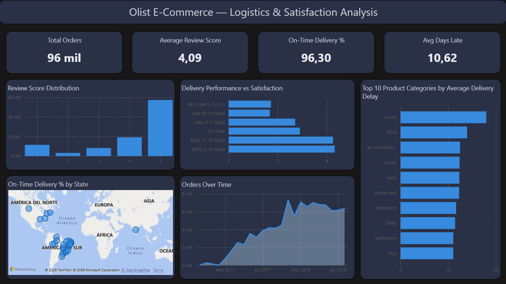

# 📦 Olist E-Commerce — Análisis de Logística y Satisfacción

> **Proyecto de análisis de datos end-to-end que explora cómo el rendimiento logístico impacta directamente en la satisfacción del cliente — construido sobre 100.000+ pedidos reales de la plataforma de e-commerce más grande de Brasil.**

[](https://python.org)
[](https://www.microsoft.com/sql-server)
[](https://powerbi.microsoft.com)
[]()
[]()

---

## 🧠 El Problema de Negocio

En el e-commerce, la velocidad de entrega no es solo un KPI logístico — es un motor de lealtad. Los retrasos no solo frustran a los clientes; destruyen directamente las calificaciones, dañan la reputación de la marca y aumentan el churn.

Olist, el marketplace de e-commerce más grande de Brasil, necesitaba responder una pregunta crítica:

> *¿Qué factores logísticos están causando bajas calificaciones — y qué regiones y categorías de productos están incumpliendo sistemáticamente las promesas de entrega (SLA)?*

Sin una visión unificada a través de 8+ tablas de datos fragmentados, el negocio no tenía forma de conectar el rendimiento de la cadena de suministro con el sentimiento del cliente.

**Este proyecto construye esa conexión.**

---

## ✅ La Solución

Un pipeline analítico end-to-end que une datos operativos fragmentados, calcula KPIs logísticos clave, realiza análisis estadístico en Python y presenta insights accionables a través de un dashboard ejecutivo en Power BI.

> *De 8 archivos CSV crudos a un dashboard listo para la toma de decisiones que revela exactamente dónde la cadena logística está fallando a los clientes — y en qué magnitud.*

---

## 📐 Arquitectura del Sistema

```
┌─────────────────────┐    ┌──────────────────┐    ┌─────────────────────┐
│   8 Archivos CSV    │───▶│  ETL SQL Server  │───▶│  Análisis Python    │
│  (Dataset Olist)    │    │  Queries T-SQL   │    │  Pandas · Seaborn   │
└─────────────────────┘    └──────────────────┘    └──────────┬──────────┘
                                                               │
                                         ┌─────────────────────▼──────────┐
                                         │       Dashboard Power BI        │
                                         │  KPIs · Tendencias · Geo · Rank │
                                         └────────────────────────────────┘
```

---

## 🔄 Metodología — Framework STAR

### Situación
El dataset de Olist contenía 100.000+ pedidos fragmentados en 8 tablas: órdenes, clientes, productos, items de pedido, reseñas, vendedores, pagos y categorías. No existía ninguna visión unificada que conectara el rendimiento logístico con el sentimiento del cliente.

### Tarea
Construir un pipeline analítico que:
- Una todas las tablas relevantes mediante queries SQL optimizadas
- Calcule métricas de retraso de entrega (fecha real vs. fecha estimada)
- Identifique la relación estadística entre retraso y calificación
- Presente insights geográficos y por categoría para decisiones operativas

### Acción

**1 — Ingeniería de Datos (SQL Server / T-SQL)**
Desarrollé 3 queries analíticas optimizadas:
- **KPIs y Revenue:** une órdenes, items, productos y categorías para calcular ingresos, costo de envío y ratio de envío por pedido
- **Rendimiento de Entregas:** calcula `días_entrega_real` y `días_retraso` (días vs. fecha estimada) para todos los pedidos entregados
- **Análisis Geográfico:** agrega ingresos, volumen, ticket promedio y costo de envío por estado del cliente

**2 — Análisis Estadístico (Python)**
- **Análisis de Boxplots:** visualizó la distribución de `días_retraso` contra `review_score` — revelando una relación estadística clara
- **Análisis por categoría:** rankeó las categorías de productos por retraso promedio de entrega para identificar cuellos de botella operativos
- Dataset: 96.353 pedidos entregados con datos válidos de entrega y reseña

**3 — Business Intelligence (Power BI)**
Construí un dashboard ejecutivo con 4 KPIs y 5 visualizaciones que cuentan una historia logística completa.

### Resultados

**Insight Clave #1:** Los pedidos que llegan incluso 1 día después de la fecha estimada muestran una caída significativa en el score promedio — confirmando que la precisión del SLA, no solo la velocidad, impulsa la satisfacción del cliente.

**Insight Clave #2:** La categoría `music` tiene el mayor retraso promedio de entrega (~18 días de demora), seguida de `food` y `air conditioning` — estos son los objetivos prioritarios para optimización de proveedores y logística.

**Insight Clave #3:** El 96,30% de los pedidos se entregan a tiempo — pero el 3,7% que llegan tarde tiene un impacto desproporcionado en la distribución general de calificaciones.

---

## 📊 Dashboard

El dashboard en Power BI fue diseñado para contar una historia completa en 5 vistas:



**Qué muestra:**

- **KPI Cards:** Total de Órdenes · Score Promedio · % On-Time · Días Promedio de Retraso
- **Review Score Distribution** — revela la cola de reseñas de 1 estrella que señalan un riesgo de retención
- **Delivery Performance vs Satisfaction** — el insight central: pedidos Very Late puntúan ~2,3 estrellas vs ~4,5 para entregas Early
- **Top 10 Categorías por Retraso Promedio** — cuellos de botella operativos rankeados para acción en la cadena de suministro
- **On-Time Delivery % by State** — cumplimiento geográfico del SLA en los 27 estados de Brasil
- **Orders Over Time** — crecimiento mensual del volumen de 2016 a 2018 — contexto para la escalabilidad logística

---

## 🔍 Hallazgos Clave

| Hallazgo | Impacto de Negocio |
|----------|--------------------|
| Pedidos con >14 días de retraso puntúan ~2,3 estrellas promedio | Riesgo severo de retención — estos clientes difícilmente vuelven |
| Entregas anticipadas (>10 días antes) puntúan ~4,5 estrellas | Superar las expectativas logísticas es un driver de lealtad |
| Categoría Music: ~18 días de retraso promedio | Intervención a nivel de proveedor requerida |
| 96,3% de tasa de entrega a tiempo | Base sólida — la optimización debe enfocarse en la cola tardía |
| Volumen de órdenes creció 10x de 2016 a 2018 | La infraestructura logística necesita escalar con la demanda |

---

## 🛠️ Stack Tecnológico

| Capa | Tecnología | Propósito |
|------|------------|-----------|
| Fuente de Datos | Kaggle — Olist Brazilian E-Commerce | 100K+ pedidos reales en 8 tablas |
| Ingeniería de Datos | SQL Server · T-SQL | Joins, cálculo de KPIs y métricas de entrega |
| Análisis Estadístico | Python · Pandas · Seaborn · Matplotlib | Distribución de retrasos, ranking de categorías |
| Visualización | Power BI | Dashboard ejecutivo y reportes de KPIs |
| Entorno | Jupyter Notebook | Análisis exploratorio y visualización |

---

## 📁 Estructura del Repositorio

```
olist-logistics-data-analysis/
│
├── notebooks/
│   └── 01_delivery_satisfaction_analysis.ipynb  # EDA Python y análisis estadístico
├── sql_scripts/
│   └── 01_data_cleaning_and_kpis.sql            # Queries T-SQL para KPIs y métricas
├── dashboard/
│   └── Olist_Ecommerce_Logistics_Dashboard.pbix # Archivo Power BI
├── data/
│   ├── olist_orders_dataset.csv
│   ├── olist_order_reviews_dataset.csv
│   ├── olist_order_items_dataset.csv
│   ├── olist_products_dataset.csv
│   ├── olist_customers_dataset.csv
│   ├── olist_sellers_dataset.csv
│   ├── olist_order_payments_dataset.csv
│   ├── olist_geolocation_dataset.csv
│   └── product_category_name_translation.csv
├── img/
│   ├── dashboard.png                            # Captura del dashboard
│   ├── python_boxplot.png                       # Análisis delay vs review score
│   └── python_top_categories.png               # Top categorías por retraso
├── requirements.txt                             # Dependencias Python
├── LICENSE                                      # Licencia MIT
└── README.md                                    # Versión en inglés
```

---

## 🚀 Cómo Ejecutarlo

```bash
# Clonar el repositorio
git clone https://github.com/AndyNavarro77/olist-logistics-data-analysis.git
cd olist-logistics-data-analysis

# Instalar dependencias Python
pip install -r requirements.txt

# Abrir el notebook
jupyter notebook notebooks/01_delivery_satisfaction_analysis.ipynb
```

Para el análisis SQL, importá los archivos CSV a SQL Server y ejecutá los scripts en `sql_scripts/`.

Para el dashboard de Power BI, abrí el archivo `.pbix` en Power BI Desktop y conectalo a los archivos CSV en `data/`.

---

## 📊 Dataset

Este proyecto usa el **Brazilian E-Commerce Public Dataset by Olist**, disponible en [Kaggle](https://www.kaggle.com/datasets/olistbr/brazilian-ecommerce).

El dataset contiene datos comerciales reales de 2016 a 2018, anonimizados y autorizados para uso público.

---

## 👤 Autor

**Andrés Navarro**
Analista de Datos · BI · SQL · Python

[](https://github.com/AndyNavarro77)
[](https://www.linkedin.com/in/andr%C3%A9s-navarro77/)
[](https://andres-navarro-portfolio.netlify.app/)

---

*Construido para demostrar pensamiento analítico real — conectando datos operativos con resultados de negocio a través de SQL, Python y Power BI en un flujo de trabajo de nivel productivo.*